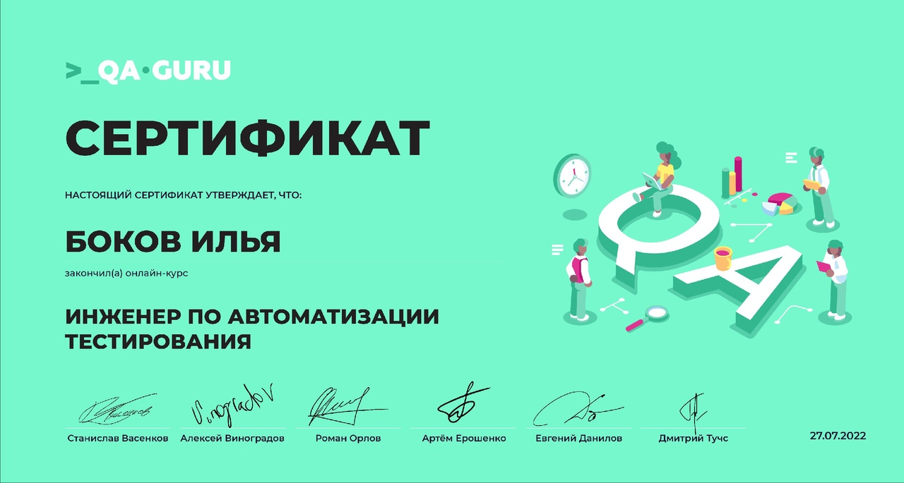

### Всем привет 👋

Меня зовут Илья, я занимаюсь автоматизацией тестирования

## :computer: Технологии и инструменты

## :open_book: Обучение

Прошел обучение в школе автоматизации тестирования :link: <a target="_blank" href="https://qa.guru/">QA.GURU</a>  

## :pencil2: Мои проекты

:link: Проект автоматизации UI+API: <a target="_blank" href="https://github.com/Bokoff-Il/qa-guru-hw13">UI+API</a>  
:link: Проект автоматизации Mobile: <a target="_blank" href="https://github.com/Bokoff-Il/qa-guru-hw-22">Mobile</a>  

## :phone: Контакты

:heavy_check_mark: <a target="_blank" href="https://t.me/bokoffil">Telegram</a> |
<a target="_blank" href="https://www.linkedin.com/in/ilya-bokov-908098242/">Linkedin</a>
